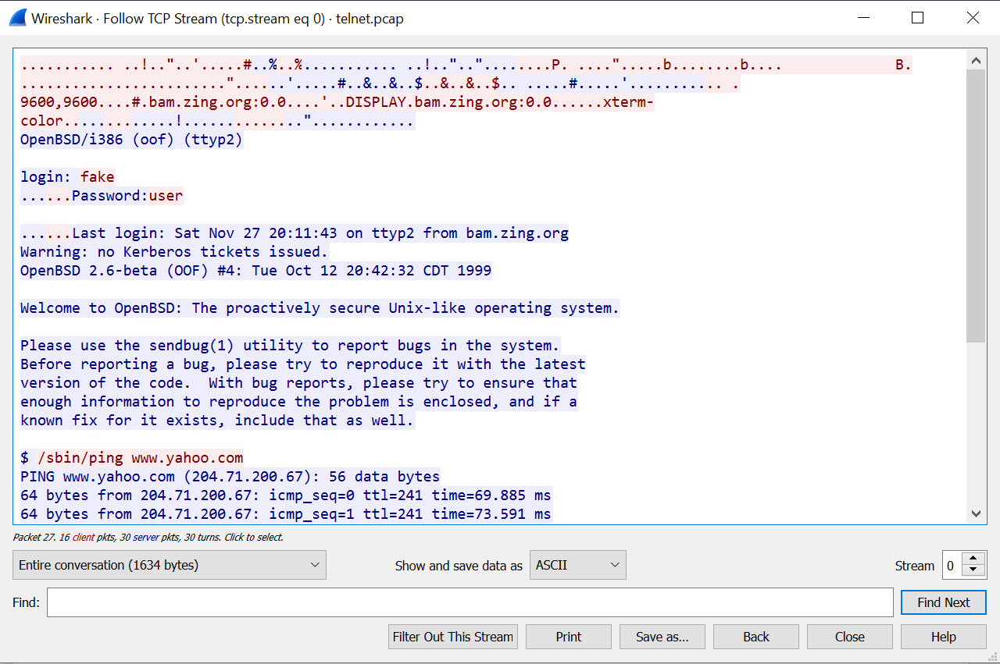

Cyber Workforce Academy
=======================

Understanding Traffic with Wireshark
------------------------------------

### Objectives:

This exercise supports a discussion surrounding the use of Wireshark begins with
familiarization with the application and uses a traffic capture file (pcap) to
demonstrate investigating the OSI model and how encapsulated traffic is
communicated given different protocols.

### Pre-requisites:

-   Wireshark Installed on workstation

-   Downloaded Exercise 1 PCAP file from Canvas link

Step 1: Open and explore the Wireshark application
--------------------------------------------------

**(Windows-based installation)**

1.  After installation, open the Wireshark application. The first menu view will
    present the options of opening a previously captured stream of traffic
    (.pcap file format) or using Wireshark to start a new, live traffic capture.
    You may have different interface options than in the image as this depending
    on the hardware (network interface cards) associated with the computer where
    you are using Wireshark. See image below.

1.  We will use Wireshark to capture live traffic. Based on the computer YOU are
    using, select the network interface that shows active traffic (notice the
    graph that indicates activity; for this demonstration the Wi-Fi adapter will
    be selected. See Arrow “A”) Ensure the proper adapter is highlighted and
    select the blue shark fin icon at the top left hand side of the screen (See
    Arrow “B”).

1.  Once you have hit the capture button, the application will start and you may
    see a number of color-coded packets beginning to display in the top most
    viewing pane (Box “A” in the image). The number of packets you see (and
    their types) is determined by how much your computer is actively
    communicating over its network interface card. Take note that there is also
    a middle and bottom viewing pane (Boxes “B” and “C” in the image); these
    provide more detail concerning the packet highlighted/selected in the top
    pane.

1.  Wireshark will continue to capture and display packets until you stop it.
    The red square icon, next to the blue shark fin icon you used to start the
    capture will stop capturing packets. The packets that have been collected
    during the capture will remain in view; they can be saved into a .pcap file
    and viewed later. Stop your packet capture. Use the file menu drop-down and
    save the traffic you have captured to your Desktop (or other location on
    your computer). This .pcap file may now be opened from Wireshark at a later
    date if desired.

2.  You will now open the .pcap file that downloaded prior to beginning this
    exercise. If you have not downloaded it you should stop now do so.

3.  Using the file menu drop-down again, select “Open”. Find the file named
    “telnet.pcap” that you downloaded for the exercise and select it. Once
    opened, you should see the first packet in the .pcap is a TCP segment with a
    source IP of 192.168.0.2 and a destination of 192.168.0.1. See image below
    and verify that you have the correct file open.

1.  Looking at the second viewing window (area labeled “B” in the orientation
    from earlier), expand the details for the IPv4 layer in the first packet in
    this pcap. You can adjust the height of the top and bottom windows so that
    the entire contents of the expanded IP layer are in view. See the image
    below.

1.  Now that you are familiar with how to expand and view the layers of the
    packet, for packet 1, minimize the IP layer and expand the TCP layer. Try to
    answer the following questions about packet 1:

2.  What is the TCP source port of this segment:_________\_

3.  What is the TCP destination port of this segment:_________\_

4.  What is the TCP flag that is set in this segment:_________\_

5.  Based on the information in the TCP portion, which part of the TCP 3-way
    handshake is this packet from:_________\_

Step 2: Deeper Exploration of Protocols
---------------------------------------

Understanding TCP connections is very important since it is one of two major
Transport layer protocols and allows so much or our day-to-day internet
interactions. Everything from web browsing, to email to file transfers can be
done with TCP. Wireshark makes it easy to look at the TCP connection process and
see what happened. In this section, we will look deeper into the details of the
telnet conversation captured in the pcap we have been viewing.

1.  You should still have the “telnet.pcap” file open in Wireshark. You will
    **right click** on TCP packet 1 in the top viewing window and select
    “Follow” -\> “TCP Stream” in the drop-down menus.

2.  This will open a new window, which has followed the TCP conversation you
    selected and re-compiled the communications within it. See the image below.

1.  Take note of the “Show and save data as” drop-down near the bottom middle of
    the window. ASCII is the default selection, but depending on the type of
    information in the capture, this may need to be adjusted. This will be
    explored in a later exercise.

2.  Try answering the following questions about the telnet communications:

    1.  Based on what you see in this pcap, what is a security concern
        surrounding the use of telnet for remote access or
        administration:______________________________________________________________________________________________________________________________________________________________________________________________________________________________________________________________\_

    2.  What were the credentials that allowed access to this remote
        device:__________________________________________________________________________________\_

    3.  Based on what you see in the window, what do you think is the
        significance of the colorization (red vs. blue) of the
        data:_______________________________________________________________________________________________________________________________________________________________________________\_

3.  Close the TCP Stream window. Take note that in the ribbon across the top of
    Wireshark, there is a new filter automatically created and applied
    (tcp.stream eq 0). For this conversation, there is only a single TCP
    conversation, but in different pcap files, you may have many tcp streams. By
    changing the number in filter, you can move to other conversations (eq 0
    would be changed to eq 1, or so on). You can also remove the filter to
    return to the view of all packets in the capture. You can also filter by a
    number of other criteria such as protocol, IP addresses, port information
    etc. See image.

Packet contents in Wireshark provide amazing details that are useful in
understanding what has happened during communications. Keep in mind that the
pcap you are investigating contains only a single TCP conversation covering the
telnet exchange; generally, a capture will contain a wide variety of traffic,
based on all the communications and exchanges traversing the network interface
card.

Step 3: Continue to Investigate
-------------------------------
