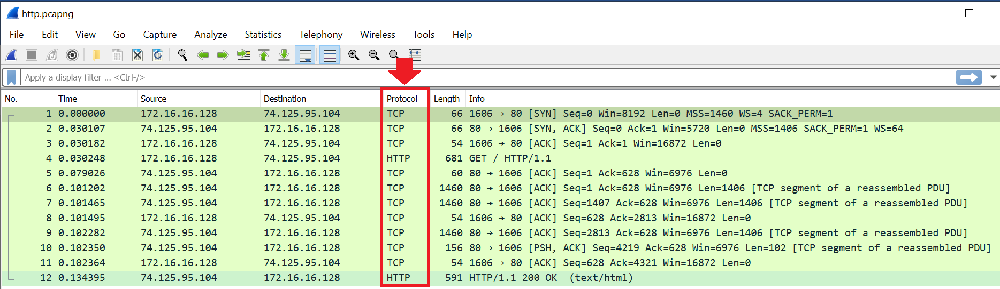

Cyber Workforce Academy
=======================

Analyzing Protocols with Wireshark
----------------------------------

Record your answers to all of the questions presented in the exercise. Ensure
you record the step number and question number for quick reference. The end of
exercise quiz located in canvas covers a random selection of these questions.
You may want to open the quiz in a separate window and complete it as you work
through the exercise. You can take the quiz as many times as needed to complete
it.

### Objectives:

This exercise supports a discussion surrounding protocol analysis using
Wireshark and various traffic capture files (pcap). This exercise is meant to
demonstrate a variety of protocol features that can be illuminated and
understood through traffic analysis.

### Pre-requisites:

-   Wireshark Installed on workstation

-   Downloaded Exercise 2 PCAP files from Canvas link

    -   arp.pcapng

    -   dns.pcapng

    -   http.pcapng

Step 1: Understanding ARP Attributes
------------------------------------

Address Resolution Protocol (ARP) is used for discovering the link
layer address, such as a MAC address, associated with a given internet
layer address, typically an IPv4 address. This mapping is a critical function in
the Internet protocol suite. RFC 826 defines ARP. See the format for an ARP
header:

The following instructions and questions will demonstrate the protocol header
and their contents in ARP communications.

**(Windows-based installation)**

-   Open the Wireshark application; using the file menu drop-down again, select
    “Open”. Find the file named “arp.pcapng” that you downloaded for the
    exercise and select it. Once opened, you should see only two packet in the
    pcap. Verify that the “protocol” column displays “ARP”. See image below and
    verify that you have the correct file open.

-   In the middle viewing window, expand the “Ethernet II” Layer of the first
    packet and answer the following questions.

1.  What is the Ethernet destination address in the frame (format
    xx:xx:xx:xx:xx:xx)?

2.  What is the Ethernet source address in the frame (format xx:xx:xx:xx:xx:xx)?

3.  What is the Hex code for the protocol (ARP) that the Ethernet layer
    indicates it has encapsulated (format 0xHex)?

-   In the middle viewing window, expand the “Address Resolution Protocol
    (request)” layer of the first packet and answer the following questions.

4.  The sender of the ARP request is seeking the MAC address of a particular
    IPv4 Address. What is the IPv4 address that the sender is requesting a
    MAC address for?

5.  The “Protocol Type” section of the ARP header indicates IPv4 (Hex code
    0x800). What is the name of the section of the ARP header that indicates
    this is a “request” (by the number 1)?

-   Switch to the second packet in the capture (click the second packet in the
    top viewing window). In the middle viewing window, expand the “Address
    Resolution Protocol (reply)” layer of the second packet and answer the
    following questions.

6.  This packet is the reply to the ARP request. What is the MAC address
    that has been provided in the reply for the requested host IPv4 address
    (format xx:xx:xx:xx:xx:xx)?

7.  The opcode for this packet indicates that it is a reply. What is the
    opcode number in the ARP protocol section for the opcode?

Step 2: Understanding DNS Attributes
------------------------------------

The Domain Name System (DNS) is a hierarchical and decentralized naming system
for computers, services, or other resources connected to the Internet or a
private network. It is an application layer protocol have may use TCP or UDP at
the Transport layer. Generally, UDP is used for requests made from a client to a
DNS Server, and TCP is used for DNS servers to share information. DNS associates
various information with domain names assigned to each of the participating
entities. Most prominently, it translates more readily memorized domain names
(like google.com) to the numerical IP addresses needed for locating and
identifying the services and devices over the network. By providing a
worldwide, distributed directory service, the Domain Name System has been an
essential component of the functionality of the Internet since 1985. See the
format and encapsulation for a DNS header:

The following instructions and questions will demonstrate the protocol header
and their contents in client-server based DNS communications.

-   Open the Wireshark application; using the file menu drop-down again, select
    “Open”. Find the file named “dns.pcapng” that you downloaded for the
    exercise and select it. Once opened, you should see only two packet in the
    pcap. Verify that the “protocol” column displays “DNS”. See image below and
    verify that you have the correct file open.

-   In the middle viewing window, expand the “Internet Protocol Version 4” Layer
    of the first packet and answer the following questions.

  1.  What is the host requesting a domain name resolution (source IPv4
        address)?

  2.  What is the DNS server the host is sending the query to (destination
        IPv4 address)?

-   In the middle viewing window, expand the “User Datagram Protocol” Layer of
    the first packet and answer the following questions.

  3.  What UDP port is the host requesting a domain name resolution using for
        the communications (source
        port):_____________________________________________________\_

  4.  What UDP port is DNS being sent to on the destination server
        (destination port)?

-   In the middle viewing window, expand the “Domain Name System” Layer of the
    first packet and answer the following questions.

  5.  Expand the “Flags” portion of the DNS header. This packet is a query;
        based on the two bytes given in the Flags portion (0x0100), what is the
        opcode value of a query (provide decimal value)?

  6.  Expand the “Queries” portion of the DNS header. What is the domain name
        that resolution has been requested for?

Step 3: Understanding HTTP Attributes
-------------------------------------

The Hypertext Transfer Protocol (HTTP) is an application layer protocol used to
transmit virtually all files and other data on the World Wide Web. Usually, HTTP
takes place through TCP/IP communication sockets (IP and port number pair).

An internet browser is an HTTP client because it sends requests to an HTTP
server (Web server), which then sends responses back to the client to interpret
and/or display. The standard (and default) port for HTTP servers to listen on is
80 (8080 and 8808 are commonly used alternate ports), though they can use any
port. See the format for a HTTP request header:

The following instructions and questions will demonstrate the protocol header
and their contents in client-server based HTTP communications.

-   Open the Wireshark application; using the file menu drop-down again, select
    “Open”. Find the file named “http.pcapng” that you downloaded for the
    exercise and select it. Once opened, you should see a series of packets
    included TCP and HTTP. Verify that the “protocol” column displays a number
    of “TCP” and “HTTP” packets. See image below and verify that you have the
    correct file open.

-   Using both the top and middle viewing windows, examine the first three
    packets (1-3) which contain TCP segments. Answer the following questions.

  1.  The first, second and third packets are parts of the initiation of a TCP
        3-way Handshake. This establishes a connection and allows TCP
        communications between two endpoints. What are the Hex codes for the
        flags in these three packets (Recall the TCP 3-way handshake consists of
        a SYN, SYN-ACK and ACK)?

  2.  The TCP conversation tracks information transferred, by using “sequence”
        and “acknowledgement” numbers. For ease of analysis, Wireshark presents
        the first segment in a TCP conversation (the initial SYN) with a
        “relative” sequence number of 0, and increments segments from there. The
        true “raw” sequence number is still preserved since it is a part of the
        bit-for-bit traffic that has been captured. Looking in the TCP layer,
        what is the “raw” sequence number where this conversation started
        (packet 1)?

-   Using both the middle viewing window, examine packets 4 and 12, which
    contain HTTP data. Answer the following questions about the HTTP layer.

  3.  Based on the request header format, the first item is the “method”. For
        packet 4, which contains a HTTP request, what method is specified and
        what does this mean?

  4.  The server responds to requests with response messages and any
        related/requested information. Looking at packet 12, what is the
        response code the server provides and what does that mean?

  5.  In packet 12, find the “Line Based Text” field. Expand this field and
        investigate it. What do you think this information is?
