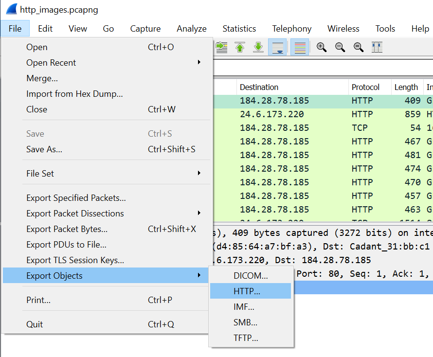
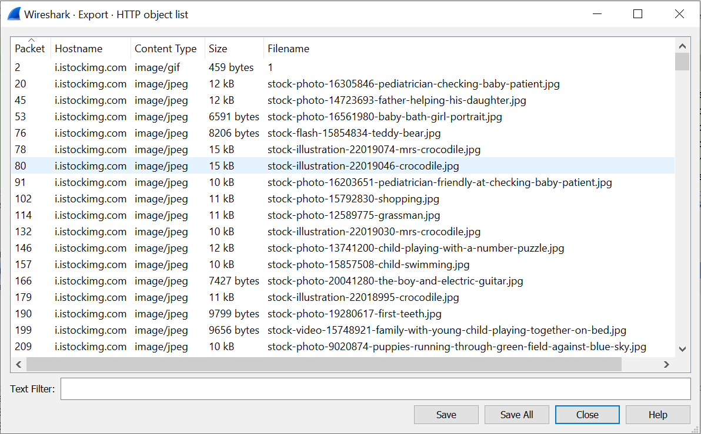
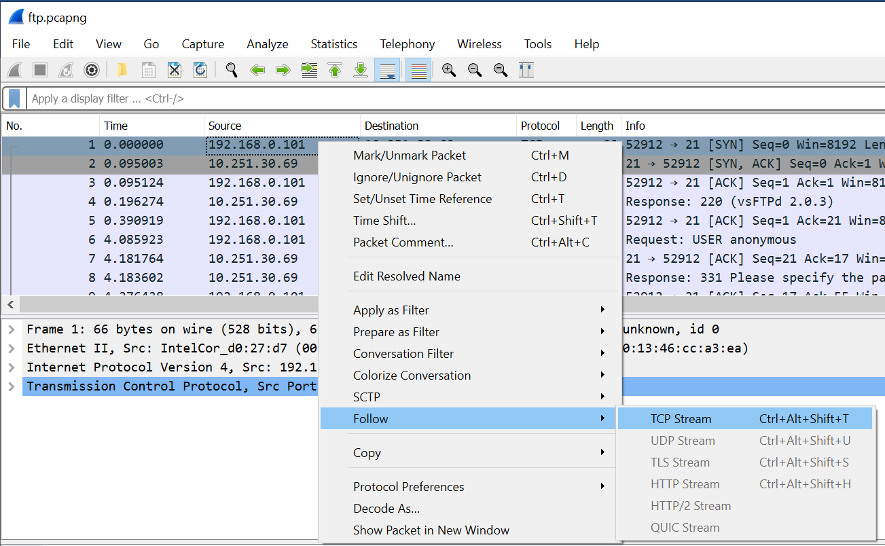
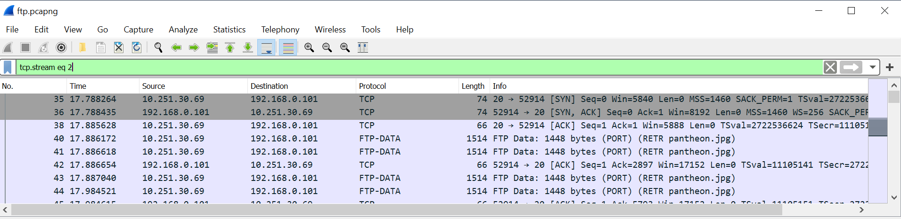
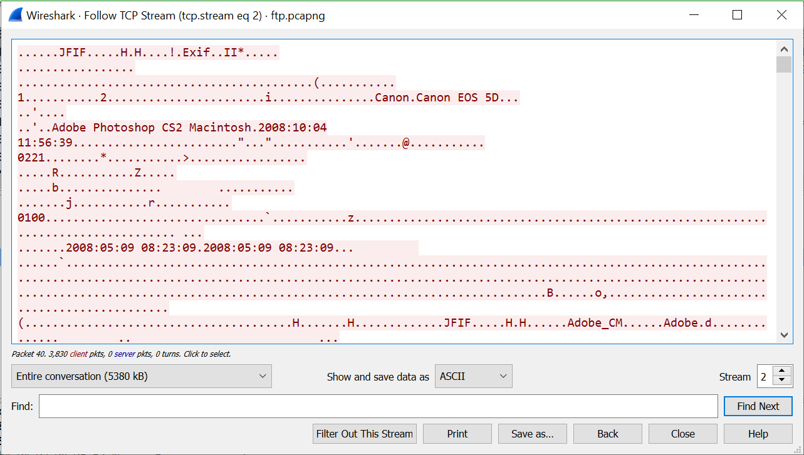
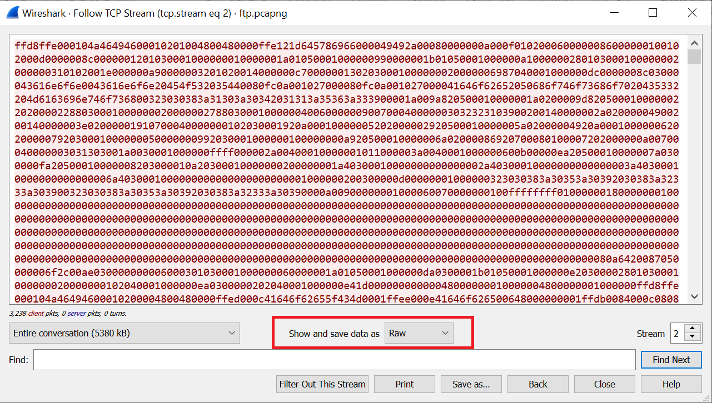

Cyber Workforce Academy
=======================

Recovering Data with Wireshark
------------------------------

Record your answers to all of the questions presented in the exercise. Ensure
you record the step number and question number for quick reference. The end of
exercise quiz located in Canvas covers a random selection of these questions.

### Objectives:

This exercise supports a discussion surrounding protocol analysis using
Wireshark and various traffic capture files (pcap). This exercise is meant to
demonstrate a variety of protocol features that can be illuminated and
understood through traffic analysis.

### Pre-requisites:

-   Wireshark installed on workstation

-   Downloaded Exercise 2 PCAP files from Canvas link

    -   http_images.pcapng

    -   ftp.pcapng

Step 1: Exporting Data Objects
------------------------------

The export data objects feature scans through the selected protocol’s streams in
the current open capture file or running capture and allows the user to export
reassembled objects to the disk. For example, if you select HTTP, you can export
HTML documents, images, executables, and any other files transferred over HTTP
and save to a selected disk location. If you have a capture running, this list
is automatically updated every few seconds with any new objects seen. The saved
objects can then be opened or examined independently of Wireshark.

The following instructions and questions will demonstrate how to export and save
data objects from HTTP (although other protocols are supported) from a pcap
file.

**(Windows-based installation)**

-   Open the Wireshark application; using the file menu drop-down again, select
    “Open”. Find the file named “http_images.pcapng” that you downloaded for the
    exercise and select it. Once opened, you should see a large number (you may
    scroll down and see a total of 3823) of packets in the pcap. Verify that the
    “protocol” column displays a number of packets of the type “HTTP”.

-   Open the “file” menu and select the option for “Export Objects”. This is
    display another menu that indicates supported protocols. Highlight and
    select “HTTP”. See the image of the menu selections below.

-   This selection will bring up a new window. Within this new window you will
    see a listing of all the objects in the capture and their type. See the
    image below.

1.  What is the title and file type of the picture sent in packet 3586?

2.  Download the object from packet 3586 and save it to your Desktop. After
    viewing the picture, what is this a picture of?

3.  How many kilobytes is the picture in packet 2104 (girl eating watermelon
    jpeg)?

Step 2: Carving Data from Common Protocols
------------------------------------------

Although TFTP (Trivial File Transfer Protocol) is supported by Wireshark’s data
object export function, another common protocol, FTP (File Transfer Protocol) is
not. This does not mean you cannot recover data transferred with this protocol
however. Because the captured data is a bit-for-bit copy of the traffic, you can
save and reassemble anything transferred, regardless of the protocol. In this
next section, we will pull the data from an FTP transfer and render it as the
appropriate file.

The following instructions and questions will demonstrate how to export and save
data objects from protocols not natively exported by Wireshark.

-   Open the Wireshark application; using the file menu drop-down again, select
    “Open”. Find the file named “ftp.pcapng” that you downloaded for the
    exercise and select it. Once opened, you should see a large number (you may
    scroll down and see a total of 5859) of packets in the pcap. Verify that the
    “protocol” column displays a number of packets of the type “TCP” or “FTP”.

-   Start by following the TCP Stream from packet 1. Recall from previous
    exercises, that to do this, you will right-click on the packet in the
    top-most viewing window, scroll down the menu to “Follow” and select “TCP
    Stream” from the next menu. See the image below for the menu selection.

-   This will bring up a new window where you can see the communications between
    a host and an FTP server. Servers using FTP actually use two ports. The
    command and control (such as authentication, communications, etc) use port

-   Data being transferred as a part of a file transfer request uses port 20. The
    communications you see for the TCP conversation selected are using port 21;
    you can see in the window that a user logged in, looked at the files in the
    directory, and then requested a file transfer (pantheon.jpg).

-   Having identified the file that is requested (pantheon.jpg), now you must
    find the data which transfers this file and extract it. Since the “Follow \>
    TCP Stream” options created a display filter, you will need to close the TCP
    stream window and manipulate this filter. The filter should show “tcp.stream
    eq 0”. This indicates the very beginning of the traffic. By changing the TCP
    stream value to 1, you can view the next stream. This stream (1) sets up
    communications between the server and host to receive data of TCP port 21
    (FTP-DATA). Set the filter’s tcp stream value to (2), as shown below to view
    the TCP stream in which the file is transferred.

-   Once the packets for TCP stream 2 are visible, you can right click on ANY
    packet in the top viewing window and select “Follow \> TCP Stream” as before
    to open the TCP stream window. See image below.

-   Notice that there are a few things that are readable (AdobePhoto shop info,
    timestamps etc.) but scrolling through the data it is largely unintelligible.
    This is because the viewing window is interpreting the data as ASCII
    (readable text characters) but the data is in fact a picture in the form of
    a jpeg file. The only portions that can be properly rendered via ASCII is
    the metadata information. In order to extract and save this data as a jpeg
    file, first you must change the “Show and save data as” field to “raw”. See
    the image below.

-   Use the “Save as…” button and save the file on your computer with the “.jpg”
    extension. You can save the file with any name you would like, as long as it
    has the correction file extension. This pulls the raw data from TCP stream 2
    out of the pcap and assembles it into a file in the save location. This file
    extension lets your computer’s operating system know how to interpret the
    data (1’s and 0’s) and reassemble them, as well as what types of programs on
    the computer can be used in this function. You should be able to locate the
    file (see a thumbnail preview of the image) and open it to display the full
    picture. See below (for simplicity, this image was saved with its original
    name of pantheon).

-   The method used here to save raw data as a file works for any protocol/data
    as long as you know how to find the specific data you want to extract, and
    what file type it should be saved as. This means that even malware/viruses
    can be extracted from a pcap. Although traffic containing malware rendered
    in Wireshark is safe since it is a graphical depiction of the bits and not
    an executable program, remember that the malware can be extracted from a
    pcap and would be live and dangerous at that point.
