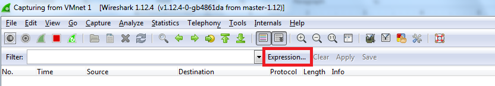
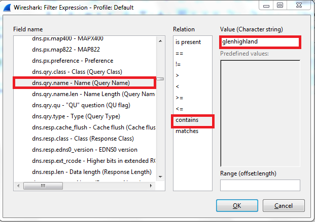
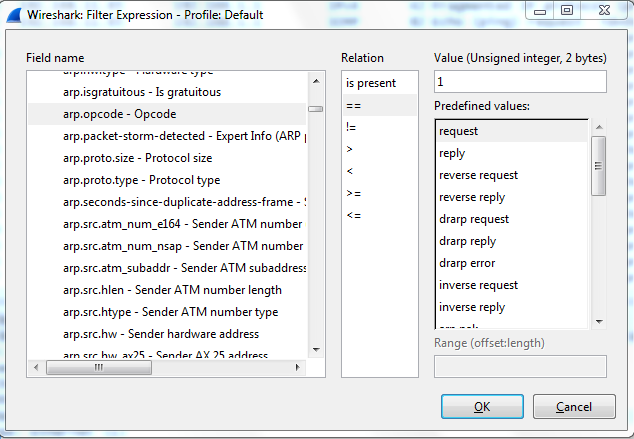
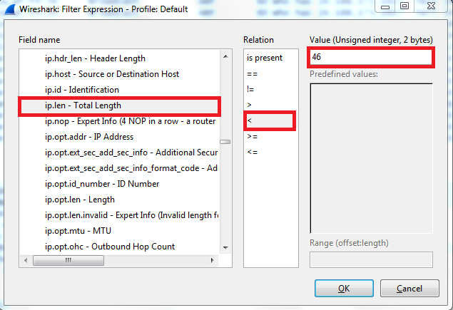
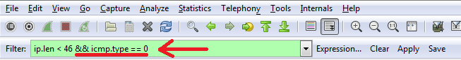

**Purpose:**These exercises will help you become more familiar with Wireshark
display filters.

**Details:**Use the pcap file **wireshark-df.pcap**

**Wireshark Filtering:**

**Exercise 1**

1.  Find the packet record number(s) where a DNS query name contains the string
    "glenhighland”

>   *Hint:* There are many ways to approach this. We'll use the Expression
>   button to assist us. Select the Expression button and a menu will appear
>   labeled "Field name" in the left column. Scroll down to and expand the DNS
>   option. Scroll down until you see "dns.qry.name" and select it.

>   Fill in the Relation and value columns. See below:

Once you are done with this exercise, select the Clear button to include all
records for examination again. Make sure you do this at the end of each
exercise.

**Exercise 2**

1.  Find all ARP **request** records.

    1.  What filter did you use? \___________________\_

    2.  How many are there? \_____________________\_

*Hint:*Scroll down to the first ARP record, number 4. Make sure that this is an
ARP request by looking in the details pane of the record for a designation of
request.

>   Try the Apply as Filter technique on the expanded Address Resolution
>   Protocol

**Exercise 3**

1.  Find the record numbers of any ICMP echo reply - ICMP type 0 - of any frame
    that needed to be zero-padded at the end because it was less than the
    minimum acceptable Ethernet length.

2.  Records matching:______________________________________________\_

>   *Hint:*The minimum acceptable Ethernet size is 60 bytes. The Ethernet frame
>   header is 14 bytes, meaning that the minimum IP datagram size is 46 bytes in
>   length. We need to examine the IP datagram total length and determine if it
>   is less than 46 bytes. It doesn't help to look at the Ethernet frame Length
>   that Wireshark maintains because it is already padded to 60 bytes.

>   A compound filter is required that tests for an IP datagram length of less
>   than 46 and and ICMP type of 0.

>   Use the Expressions: button to compose the first part of the filter for the
>   IP Total Length by expanding the field name "IP" and scrolling down to find
>   ip.len

>   After it appears in the filter display, enter the" \<46 &&" (no quotes) and
>   supply the text "icmp.t" (not in quotes).

